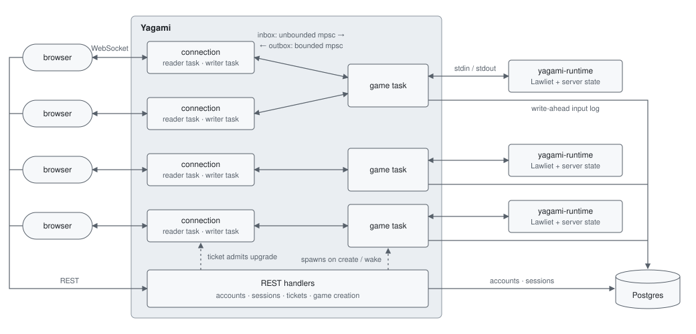

# Requiem

Requiem is a hosted, real-time platform for running multi-day Death Note social deduction games.
Players act through a client, a host monitors the game live, and the server keeps every
game durable, replayable and rewindable. Under the game sits a deterministic, event-sourced
simulation engine and a server built around the idea that a game is its input log.

**Live:** [requiem-dn.dev](https://requiem-dn.dev)

## Components

- **Lawliet** (`lawliet/`) — deterministic, headless simulation engine. Pure Rust, no I/O, no clock, no threads.
- **Yagami** (`yagami/`) — platform server: accounts, game lifecycle, persistence, access control, and distribution over WebSocket.
- **Yagami runtime** (`yagami/yagami-runtime/`) — per-game child process: Lawliet plus the server's simulation state (keys, names), driven over a pipe.
- **Amane** (`amane/`) — the client. `amane-client` is a framework-free TypeScript core, `amane-ui` the React surface, `amane-web` the browser host.

## Architecture



Many clients narrow into one server process, which fans back out into one OS process per running
game. Each game is owned by a single Tokio task that serializes everything that it receives.
The engine behind that task never sees a socket, a database, or wall-clock time.

The only durable game state is the **accepted input stream**: the ordered list of inputs that the
runtime accepted. Engine state, key sets, player names, and the entire output history are
projections, rebuilt by feeding that stream to a fresh runtime.

## Design

### Lawliet

#### Event sourcing

The engine is a function from an ordered list of `ActionRequest`s to a world
and a stream of `Command`s. Nothing is saved but the inputs.

**Why?**
Crash recovery, hibernation, rewind, and admin audit all become the same trivial replay operation.

**Tradeoff:** Boot cost grows with game length.
This can be mitigated with snapshots, but I'm deferring that until I see that it's actually necessary.
State snapshots lead to messy problems that I'd rather not deal with yet.
A game typically peaks at around one event per second, so replay would be cheap unless a game has lasted for actual months.

**Tradeoff:** The engine has to be logically deterministic. One flaw, and a log corrupts.

#### Two-pass transactional pipeline

Every action runs twice: a dry `validate` pass that walks the
full sub-action tree without mutating or emitting, then an `execute` pass that must succeed.

**Why?**
Actions compose recursively (a kill can sever links, cancel polls, release prisoners), and
a failure three levels deep should not leave the world half-changed. Validation gives atomicity
without a rollback mechanism or cloning the world.

**Tradeoff:** each action handler is written once against a `mutate` flag and executed twice.

#### Virtual clock and deterministic scheduler

The engine has no automatic clock.
Each input carries a timestamp. Before executing it, the engine drains a min-heap of scheduled jobs
due at or before the time being processed.

**Why?**
Timed game events (poll timeouts, scheduled kills, prosecution phases) fire at exactly the
same point in the stream on every replay, regardless of when the replay happens, making race
conditions completely impossible.

Due jobs are executed like any other action, before the incoming one.
Their commands are returned even if the incoming action is then rejected, because the jobs already
changed the world. A job that is itself rejected doesn't emit anything. Its output is discarded.
An error says "you can't do this, here's why". If an action was scheduled, nobody
is waiting on an immediate response. The output doesn't matter outside of the things it changes.

**Tradeoff:** The server needs to drive time manually. The engine doesn't do it itself.
The server handles this by sending in "Null" actions on some interval.

#### Viewports for visibility

Commands are addressed to a recipient (an actor, a viewport, a
log, or the system) rather than broadcast and filtered. The engine decides who sees what. The
server only acts as a router. A viewport's history is self-contained. If a command refers to some
object, then that object is either globally visible, or had its existence emitted within that same viewport.

**Why?**
A huge chunk of the game relies on information asymmetry.
Making each audience an isolated, replayable log means access control is one rule in one place rather
than a convoluted server-side filter.

### Yagami

#### Per-session process + coordinating Tokio task

Each running game is one async task that owns
a `yagami-runtime` child and talks to it over line-delimited JSON on stdin/stdout, one exchange
at a time.

**Why?**
The engine is designed to crash fast on any inconsistency. A process boundary prevents one isolated failure
from taking down the entire server.
The single task gives each game a clear ordering of inputs with no locks around game state and makes things
much easier to work with.

#### Connection flow: key → ticket → upgrade

A key is a durable credential carrying a
privilege set: which in-game actors it has access to and its capabilities.
It is exchanged over a REST API for a short-lived, single-use ticket, and the ticket is claimed inside the
WebSocket upgrade handler in a single lock acquisition.
Joining a game only needs a key (you can join a game without an account).

**Why?**
Browsers can't attach metadata to a WebSocket handshake outside of what a URL implies, but the browser
logs URLs, so you don't want to use the key as the URL, because that puts something that's meant to be
secure into local logs. It'd also be harder to differentiate different connections that share the same key.

Instead, a ticket is generated via a POST REST API endpoint, with the key in the HTTP header. The request
returns a new short lived ticket, which doubles as a connection identifier. The ticket is used to access a
WebSocket URL and perform the upgrade.

The ticket is claimed BEFORE the WebSocket upgrade goes through, and wrapped with a drop guard.

**Why?**
The WebSocket upgrade might fail. This should not brick a ticket and pollute RAM.
There is also a window where a connection might go through, but some other connection request might have already
claimed the ticket. This essentially makes the WebSocket useless. It's better to claim immediately.
The drop guard ensures that the ticket is freed in either scenario (successful upgrade, on disconnect, or failure).

#### Write-ahead persistence and crash recovery

An input is first sent into the simulation,
and if it is accepted, it is committed to Postgres. Only after that is the result sent to clients.

**Why?**
You don't want clients to see their input acknowledged, only for that state to be lost afterwards.

Recovery is simple. Spawn a fresh runtime, and send in the same input sequence.
A crash also logs the reproducing sequence to a separate table for debugging.

#### Time travel and reconciliation

Each game runs on a sandboxed clock — real elapsed time plus
an offset/anchor. Client timestamps are ignored. Inputs have their time overwritten by the server using its virtual clock.

A forward jump shifts the anchor and sends in a Null action to drive the simulation forward.
A backward jump truncates the log up to and including the target time, deletes the tail from the database,
and reboots from what remains.

**Why?** Rewind falls out of event sourcing for free, and hosts need it to undo mistakes in a game
that runs for days. It's also just cool.

Everything derived from the old timeline has to be reconciled afterwards (caches in DB, active connections, etc...)
Keys created after the target no longer exist, so their connections need to be dropped.
Every surviving connection is sent a re-initialization packet to keep their client state up to date,
since client state is typically monotonic.

Server-drawn secrets (true names, keys) come from a seeding input that replay reproduces. Whenever something that
could reveal the seed is leaked (true name or similar), I send in a new seeding input.
I've seen issues in games that use the same algorithm as me (PCG) where based on a seed leak, people
could manipulate RNG. I wanted to prevent this from even being possible.

#### Hibernation, caps, and backpressure

A game with no connections for a configurable period checkpoints
in the DB and exits. The next ticket request for it validates the key and wakes it.
After a server restart nothing is immediately resumed. Every game is hibernated on server boot.

Games are intended to last about a week. This is a slow-burn game. In the same way that Discord has idle periods,
this game has idle periods. Idle games aren't discarded. They are only put to sleep, freeing up a slot in RAM.

- The number of games held in RAM at the same time is capped, and attempting to spawn a new runtime
  beyond the cap is immediately refused rather than queued.
  This is because a game may be active in RAM for an arbitrary period of time.
  Just telling someone "in progress" is dishonest, because it could take hours, theoretically, for a slot to open up.
  It's better to refuse outright and have them try again later. If a game is inactive for the configured time period,
  it happens automatically.
  I could make a server-side queueing system, but it isn't yet worth the complexity.
  I am not even close to hitting residence caps yet. My current server has about 4GB of RAM.
- A game that fails to boot retries with exponential backoff, then enters a cooldown so client
  retries can't repeatedly start the cycle. The retry mechanism exists because there could theoretically
  be some transient freak circumstances leading to boot failure. If the game fails to boot beyond this point,
  there is either something wrong with the game or the environment that needs attention.
- Each connection has a bounded outbox. A client too slow to drain it is dropped immediately.
  A slow client doesn't threaten the server. The client reconnects and resyncs when it's back to normal.
- Inbound messages are rate-limited per connection by not reading the socket, pushing the backlog
  into the kernel buffer and back onto the sender.
- REST is rate-limited per IP, with a tighter bucket on anything that hashes a password.

Every limit above is a `YAGAMI_*` environment variable; see [`yagami/.env.example`](yagami/.env.example).

### Amane

- **Headless core.** `amane-client` is just plain TypeScript. It handles networking,
  holds the client's state, and exposes queries. A host injects its capabilities, and a shell
  (an interaction surface + add-ons) wraps around the client to achieve some goal.
  The same core is meant to drive both the React UI and a future CLI (eventually, I want to
  have AI agents simulate real players, using the exact same client. A cool Turing test type
  experiment).
- **Client-side permission checks are UX, not security.** The server sends a client its privileges.
  The client uses this to render what it's capable of doing.
- **A bad command can't brick a session.** A command that throws while being applied is caught,
  recorded as a fault, and skipped.
  Without this, a single client error would essentially ban a client from joining that game,
  because a client always receives the exact same command stream on reconnect.

## Testing

- **Determinism** is verified by the suite as a whole. What matters is logical determinism,
  not bit determinism. Any divergence in logical determinism would cause some tests to randomly fail,
  because there is such a large quantity of them. None do.
- **Engine** — roughly 300 unit tests in `lawliet-core`, in the root modules of the actions they cover
  and calling the engine through its public `execute` entry point.
  The tests focus on obscure interactions and state interacting throughout multiple sub-systems.
  Basically, things that would only be found after something goes wrong in production.
- **Two-pass agreement** is checked on every action in every test and in production: an
  `execute` pass that fails after `validate` passed is a panic.
- **Delivery** — `yagami/src/delivery.rs` tests the server's access control against hand-built
  output logs: viewport entry backfills, exit stops delivery without retracting, re-entry delivers
  only the gap, sibling logs never leak, and live delivery is identical to a reconnect replay.
- **Client** — `amane-client` folds a command stream through a real `Session` under plain Node,
  with no browser and no server, which is also the check that the core stays headless.
- **Crash path** — the engine exposes an admin `Crash` action that panics on purpose, to exercise
  kill → reboot → replay against a live game.

```sh
cargo test --workspace
npm test -w amane-client
```

## Deployment

CI ([`.github/workflows/ci.yml`](.github/workflows/ci.yml)) runs on every push and pull request
to `main`, and deploys on push:

- **Server** — `cargo fmt --check`, `clippy -D warnings`, and the workspace tests gate a
  multi-stage Docker build (`cargo-chef` for dependency caching) that produces a slim Debian image
  with `yagami` and `yagami-runtime`, pushed to GHCR tagged by commit SHA.
- **Rollout** — CI SSHes to a Hetzner VPS as a user whose key is pinned to
  [`deploy/deploy-yagami.sh`](deploy/deploy-yagami.sh). The script accepts nothing but a
  `sha-<hex>` tag, then pulls and restarts via Docker Compose. A deploy restarts the server, and
  running games come back by replay on their next connection.
- **Stack** — [`deploy/compose.yml`](deploy/compose.yml): Yagami bound to localhost, Postgres,
  and Caddy terminating TLS for `api.requiem-dn.dev`. Migrations run on boot.
- **Client** — type-checked and tested, built with Vite, and deployed as static assets to
  Cloudflare Workers.
